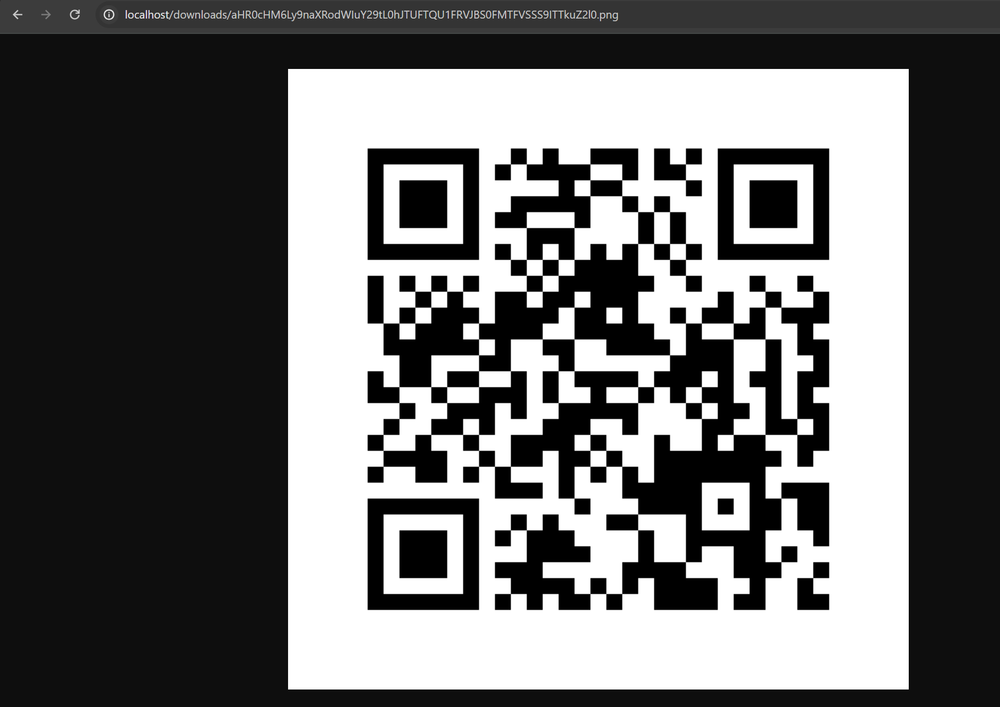

# RestAPI for Creating QR Codes --> HM9

1. Cloned [repo](https://github.com/kaw393939/qr_code_api_broken_code.git)
2. Made virtual environment:  python3 -m venv env
3. Activated virtual environment: source env/bin/activate
4. Installed requirements: pip install -r requirements.txt
5. created directory using mkdir qr_codes.
6. started docker.
7. made changes to pass test
8. checked pytest locally to check that it works locally
9. Started the app with docker compose up --build
10. checked http://localhost/docs to view openapi spec documentation
11. Click "authorize" input username: admin password: secret
12. Test making,  retrieving, and deleting QR codes on the spec page.

below is the image of qr code made using localhost

